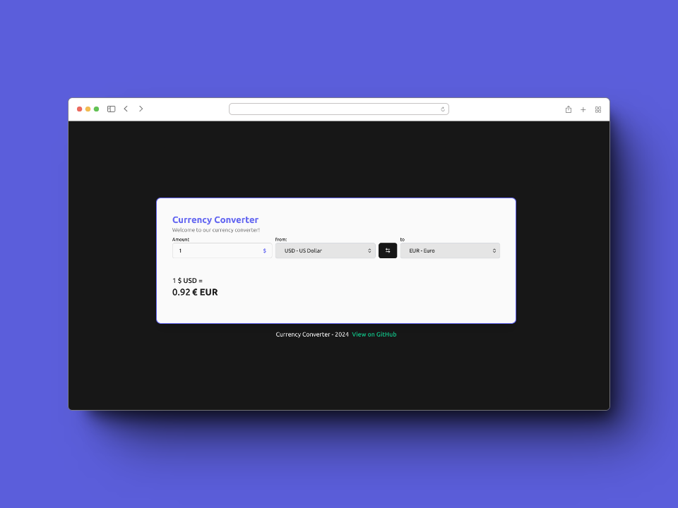
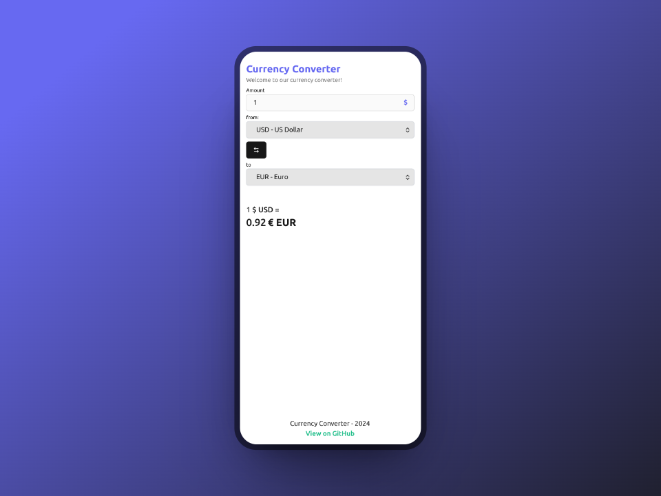

# Currency Converter (Conversor de Monedas)

Esta aplicación te permite convertir monedas utilizando la [API de Free Currency](https://freecurrencyapi.com).





### Clonar el Repositorio

```bash
git clone https://github.com/MicaheDev/currency-converter
```

Una vez clonado el repositorio, navega hasta el directorio del proyecto.

### Instalación de Dependencias

Para instalar las dependencias del proyecto, ejecuta el siguiente comando en tu terminal:

```bash
cd currency-converter
npm install
# o
yarn install
# o
pnpm install
```

### Crear Variable de Entorno

Crea un archivo `.env.development` en la raíz del proyecto y agrega tu clave de API:

```env
NEXT_PUBLIC_SERVICE_API_KEY=tu_clave_de_api_aqui
```

### Ejecución Local de la Aplicación

Para ejecutar la aplicación de manera local, utiliza uno de los siguientes comandos:

```bash
npm run dev
# o
yarn dev
# o
pnpm dev
# o
bun dev
```

La aplicación se ejecutará en el puerto [http://localhost:3000](http://localhost:3000).

### Tecnologías y Herramientas Utilizadas

- **Netx JS (v14)**  
- **Typescript**  
- **Tailwind CSS**  
- **Three.js**  

### Estructura del proyecto

```plaintext
src/
  ├── app/
  │   ├── layout.tsx        # Layout principal de la aplicación que define la estructura general de la página.
  │   ├── page.tsx          # Página principal del proyecto que muestra el contenido principal.
  ├── components/           # Componentes de la aplicación.
  ├── constants/            # Archivos de constantes utilizadas en toda la aplicación, como URLs de API, tipos de acciones, etc.
  ├── hooks/                # Custom hooks que encapsulan lógica reutilizable para componentes funcionales.
  ├── interceptors/         # Interceptors utilizados para manejar peticiones HTTP, eventos o tareas específicas.
  ├── models/               # Definición de modelos de datos utilizados en la aplicación, como interfaces o clases.
  ├── services/             # Servicios para interactuar con APIs externas, realizar tareas específicas o gestionar la lógica de negocio.
  ├── styles/               # Estilos globales y reglas de Tailwind CSS para una apariencia coherente.
  ├── utilities/            # Funciones de utilidad y herramientas comunes utilizadas en diferentes partes de la aplicación.
  └── ...                   # Otros archivos y carpetas necesarios para el funcionamiento y desarrollo de la aplicación.
```